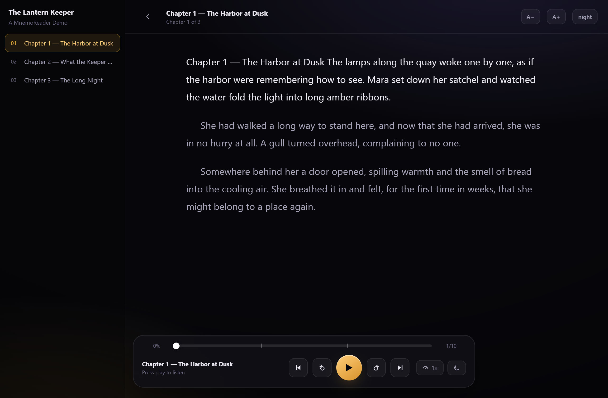
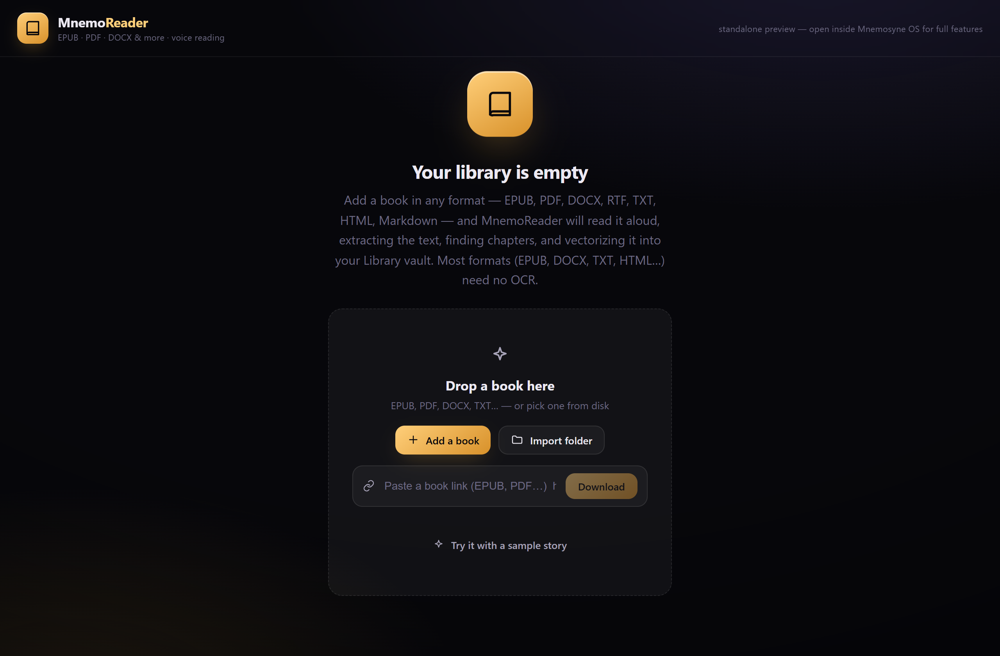

# MnemoReader

**A living book library with voice reading — EPUB, PDF, DOCX and more. A cartridge for [Mnemosyne OS](https://github.com/yaka0007/Mnemosyne-Neural-OS).**

> [!IMPORTANT]
> **MnemoReader is a cartridge — it runs inside Mnemosyne OS.** Install the host app first, then load this cartridge from MnemoHub (or link it in dev mode).
>
> [](https://github.com/yaka0007/Mnemosyne-Neural-OS/releases/latest) &nbsp; [](https://github.com/yaka0007/Mnemosyne-Neural-OS)

Drop a book — **EPUB, PDF, DOCX, RTF, TXT, HTML, Markdown…** — or a whole folder, and MnemoReader:

- 📖 **Extracts the text** host-side (pdf-parse / mammoth — PDF, DOCX, TXT, MD…)
- 🧠 **Vectorizes + archives** it into a dedicated **Library vault** (SHA-256 dedup, auto-spines)
- 🔖 **Auto-detects chapters** from headings, numbering, and structure
- 🔊 **Reads it aloud** with **word-synced karaoke highlighting**, resume position, chapter jumping, variable speed, and a sleep timer

<p align="center"><em>Dark reading-lamp UI · liquid-glass surfaces · fluid motion.</em></p>



---

## How it works

MnemoReader is a sandboxed **cartridge**: it runs in an iframe and talks to the
host only through a whitelisted postMessage bridge (`src/lib/bridge.ts`). It
declares exactly the permissions it needs (`vault:read`, `vault:write`,
`model:infer`, `dialog:open`, `shell:open`) and nothing more.

```
MnemoReader (iframe)                 Mnemosyne OS host
────────────────────                 ─────────────────
dialog.selectFile      ───▶  OS file picker
reader.extractDocument ───▶  pdf-parse / mammoth  → plain text
reader.ttsStatus/Voices───▶  local Piper neural engine (status/voices)
reader.ttsSpeak        ───▶  Piper  → raw PCM (played via Web Audio)
reader.ingest          ───▶  routePulse → vectorize + archive into LIBRARY vault
```

### Two voice engines, one player

| Engine | Quality | Karaoke | Availability |
|--------|---------|---------|--------------|
| **System voice** (Web Speech) | good | **exact** (word-boundary events) | always, in-browser |
| **Neural (Piper)** | excellent | time-interpolated | when installed + licensed in the host |

The reader starts on the system voice and offers Piper when the host reports it
ready. If the neural engine is unavailable mid-session, it falls back gracefully.

## Try it standalone

You don't need the full OS to explore the reader UI:

```bash
pnpm install
pnpm dev          # http://localhost:5210
```

Then click **“Try it with a sample story”** — the reader, karaoke highlighting,
chapters, and system-voice playback all work in a plain browser tab. (PDF import
and vault archiving require running inside Mnemosyne OS, which provides the file
picker, extractor, and vault engine.)



## Build

```bash
pnpm build        # tsc + vite → dist/  (served via mnemo-plugin:// when installed)
```

## Project layout

```
src/
├── App.tsx                 # library ⇆ reader, ingest pipeline, toasts, resume
├── styles.css              # design system (glassmorphism, amber accent, motion)
├── sdk/mnemo-sdk.ts        # postMessage bridge to the host
├── lib/
│   ├── bridge.ts           # typed reader ⇄ host actions
│   ├── voice.ts            # ReaderPlayer — browser + Piper backends, gapless
│   ├── pdf.ts              # sentence split, chapter detection, ingest chunking
│   ├── vaults.ts           # provisions the Library vault
│   └── types.ts
└── components/
    ├── Library.tsx  BookCard.tsx      # cover grid, progress rings, ingest states
    ├── Reader.tsx   ChapterRail.tsx   # reading canvas + chapter navigation
    ├── AudioDock.tsx                  # transport, scrubber, speed/voice/sleep
    └── Icons.tsx    Toast.tsx
```

## License

MIT © Mnemosyne Labs. Contributions welcome — this cartridge is meant to be
forked and remixed.
